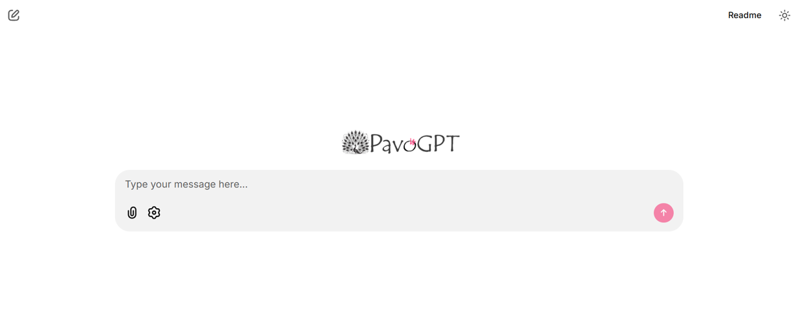
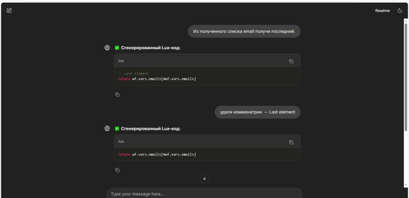
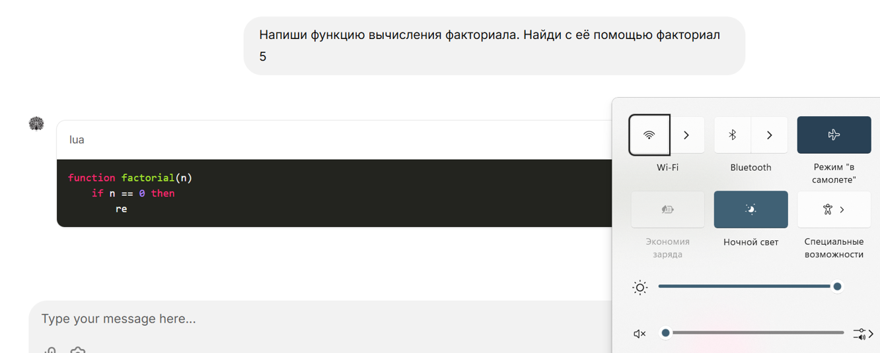
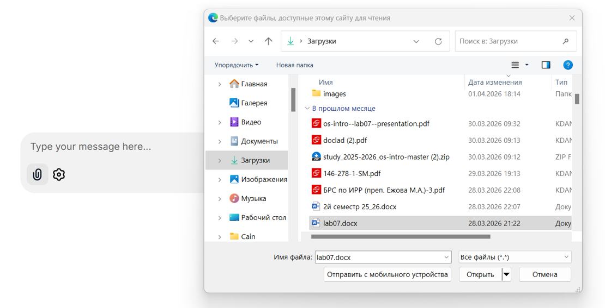

# PAvoGPT-MTC-Hack
# Local Lua Agent — AI code generator for Lua

A system for locally generating Lua code in natural language. Works completely offline, without an external API. Includes an agent with iterative validation and error correction.

## Screenshots 

### Main screen



### Chatting



### Ofline usage



### Document reading



## Quick Start

1. Download and unzip the project archive in any application.

2. Open a terminal (command key) and turn on this indicator:
``` bash
cd C:\path\to\project\folder
```

3. Run all services in one pair:
``` bash
docker-compose --build
```
